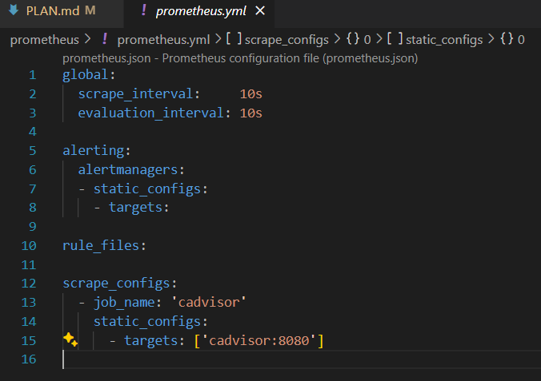

# Explication du projet

Pour ce projet "Monitoring" nous avons choisis d'utiliser la stack Grafana, Promeheuse et Loki (accompagné de cAdvisor afin de monitorer des containers docker).
Pour lancer le projet il suffit juste de cloner le projet et lancer un docker compose up.

# Étapes de configuration

## 1. Préparer les fichiers de configuration de Prometheus

- Dans le répertoire projet_monitoring, on a ajoutez un sous-répertoire prometheus et ajouté un fichier prometheus.yml avec la configuration de base pour gratter les métriques de cAdvisor et d'autres services.

- Ensuite, on a ajoutez la configuration de Prometheus dans ce fichier.



## 2. Préparer les fichiers de configuration de Grafana

- On a crée un sous-répertoire grafana dans projet_monitoring.

- À l'intérieur, on a définie les sources de données et les tableaux de bord.


- Ensuite, on a renseignez les fichiers avec les configurations pour connecter Grafana à Prometheus et à Loki.


## 3. Configurer Docker Compose

À la racine du répertoire projet_monitoring, on a crée un fichier docker-compose.yml.


## 4. Lancer les services avec Docker Compose

Une fois que tous nos fichiers de configuration sont prêts, nous pouvons démarrer nos services avec la commande suivante :

```
docker-compose up -d
```

Cela va télécharger les images nécessaires, créer et démarrer les conteneurs en arrière-plan.

## 5. Accéder à Grafana

- Une fois les services démarrés, on ouvre un navigateur et on accéde à Grafana en tapant l'adresse http://localhost:3000. 

- On se connecte avec les identifiants administrateur définis dans le docker-compose.yml (admin/test).


- Et on arrrive sur l'interface Grafana.

## 6. Configurer vos tableaux de bord

### Dans l'interface Grafana :


- On peut configurer les tableaux de bord en utilisant les données de Prometheus et Loki. 

- On peut créer des graphiques, des jauges et des listes d'alertes.

- On peut aussi configurez et ajustez les alertes dans Grafana et Prometheus pour surveiller les métriques et logs.


## Conclusion
En suivant ces étapes, on a mis en place un système de monitoring capable de collecter et de visualiser des métriques et logs pour la surveillance d'une applications par exemple. Grafana Nous permet de visualiser l'interactives et définir des alertes pour rester informé de l'état de l'infrastructure de l'application.

---

By Nolan CANO & Yohan VELAY